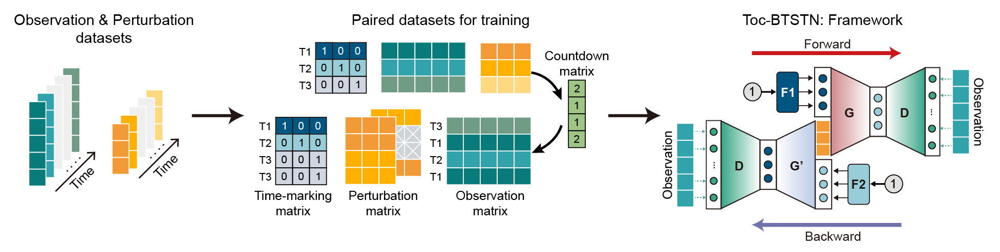

<h1 align="left">Toc-BTSTN (version 1.0)</h1>

<p align="left">
    <a href="https://www.python.org/"></a>
    <a href="https://pytorch.org/"></a>
    <a href="LICENSE"></a>
</p>

## 1. Introduction
`Toc-BTSTN` is a Python package developed to model the metabolic responses to perturbations and optimize strategies for process control based on the ***Bidrectional Time-series State Transfer Network***.

## 2. Framework
<div align=center></div>

## 3. Installing and Importing

### Requirements
The source code was developed in `Python 3.9` using `PyTorch 2.7.0`.

### Installation
Clone the repository and install the required dependencies:

```bash
git clone https://github.com/xsh93/Toc-BTSTN.git
cd Toc-BTSTN
pip install -r requirements.txt
```
### Adding Toc-BTSTN to Your Environment
Before importing BTSTN, add it to your Python path:
```python
import sys
sys.path.insert(0, 'your_path/Toc-BTSTN')
```

### Importing BTSTN
Now, you can import BTSTN from scripts.train:

```python
from scripts.train import BTSTN
```

## 4. Data Format
The model training requires two datasets as input, including the `Observation` and `Perturbation` datasets.

***Observation dataset***
|*Batch*|*Time* |*Parameter 1*|*Parameter 2*|*Parameter 3*|...|
|:-:    |:-:    |:-:          |:-:          |:-:          |:-:|
|__A1__ |__T1__ |2.1          |5.0          |0.2          |...|
|__A1__ |__T2__ |NA           |4.3          |0.8          |...|
|__A1__ |__T3__ |3.8          |NA           |0.1          |...|
|__B1__ |__T1__ |2.1          |5.0          |NA           |...|
|__B1__ |__T3__ |1.4          |4.3          |0.7          |...|
|__B1__ |__T4__ |3.8          |0            |1.0          |...|
|__...__|__...__|...          |...          |...          |...|

***Perturbation dataset***
|*Batch*|*Time* |*Perturbation 1*|*Perturbation 2*|...|
|:-:    |:-:    |:-:             |:-:             |:-:|
|__A1__ |__T1__ |1.2             |10.0            |...|
|__A1__ |__T2__ |1.2             |10.0            |...|
|__A1__ |__T3__ |1.1             |15.0            |...|
|__B1__ |__T1__ |0.2             |5.0             |...|
|__B1__ |__T3__ |0.5             |6.0             |...|
|__B1__ |__T4__ |0.2             |5.0             |...|
|__...__|__...__|...             |...             |...|

## 5. Read Your Data
We use the simulated datasets of ***Van der Pol*** system under varing perturbation parameter ***μ*** for demonstration. The datasets include 6 train sets (***Train 1-6***) and 5 test sets (***Test 1-5***).

```python
import pandas as pd
odata = pd.read_csv("./analysis/data/observe_data.csv", sep=",")
pdata = pd.read_csv("./analysis/data/perturb_data.csv", sep=",")
```

## 6. Define Your Model
`BTSTN` provides a simple tool to define the structure of model and training parameters.

```python
# Initialize the model
obj = BTSTN(
    o_features=2,
    o_hid_dims=2,
    p_features=1,
    g_inner=32,
    g_layer=6,
    g_dropout=0,
    g_activation={"fc_name": "relu"},
    d_inner=32,
    d_layer=1,
    d_dropout=0,
    d_activation={"fc_name": "relu"},
    unit=0.1,
    dropna=False,
    scale="MinMax"
)
```

## 7. Train Your Model
You can train the model for ***Van der Pol*** system with following codes or use the pre-trained model ***vdp_model*** for prediction.

```python
# Train data
train_set = ['Train_1', 'Train_2', 'Train_3', 'Train_4', 'Train_5', 'Train_6']
odata_train = odata.loc[odata['batch'].isin(train_set), :].reset_index(drop=True)
pdata_train = pdata.loc[pdata['batch'].isin(train_set), :].reset_index(drop=True)

saving_path = './analysis/model/'
saving_prefix = 'vdp_model'
os.makedirs(os.path.join(saving_path, saving_prefix), exist_ok=True)

# Train model
loss = obj.fit(
    odata=odata_train,
    pdata=pdata_train,
    max_gap=15,
    learning_rate=0.01,
    decay_gamma=0.98,
    epoch=500,
    patience=50,
    batch_size=1500,
    gpu_id=-1,
    saving_path=saving_path,
    saving_prefix=saving_prefix,
    ckpt_path=saving_path,
    ckpt_prefix=saving_prefix,
    ckpt_freq=50,
    ckpt_resume_epoch=None,
)
```

## 8. Perturbation prediction
The pre-trained ***vdp_model*** is used for trajectory prediction under specified perturbation sequence of ***μ***.
```python
# Test data
train_set = ['Test_1']
odata_test = odata.loc[odata['batch'].isin(test_set), :].reset_index(drop=True)
pdata_test = pdata.loc[pdata['batch'].isin(test_set), :].reset_index(drop=True)

# Load model
obj = BTSTN.load_pretrained(ipath="./analysis/model", model_name="vdp_model")

# Time-series prediction under perturbations
pred_data = obj.forecast(
    odata=odata_test.iloc[:1, :].reset_index(drop=True),
    pdata=pdata_test.iloc[:1, :].reset_index(drop=True),
    sdata=pdata_test[0:-1].reset_index(drop=True),
    start=0,
    reset=True,
    max_gap=15,
    learning_rate=0.01,
    decay_gamma=0.98,
    epoch=1000,
    patience=100,
    batch_size=250,
    gpu_id=-1
)
```

## 9. Control strategy optimization
The pre-trained ***vdp_model*** is used for control strategy optimization for achieving pre-specified targets.

```python
# Test data
train_set = ['Test_1']
odata_test = odata.loc[odata['batch'].isin(test_set), :].reset_index(drop=True)
pdata_test = pdata.loc[pdata['batch'].isin(test_set), :].reset_index(drop=True)

# Load model
obj = BTSTN.load_pretrained(ipath="./analysis/model", model_name="vdp_model")

# Set target
rdata = pd.DataFrame([[1.5, 0]], columns=['x', 'y'])
pred_step = 500

# Optimization of control strategies
scheme = obj.search_scheme(
    odata=odata_test.iloc[:1, :].reset_index(drop=True),
    pdata=pdata_test.iloc[:1, :].reset_index(drop=True),
    rdata=rdata,
    start=-1,
    pred_step=pred_step,
    n_scheme=-1,
    reset=True,
    max_gap=15,
    learning_rate=0.01,
    decay_gamma=0.97,
    epoch=500,
    patience=30,
    batch_size=250,
    gpu_id=-1
)
```

## Citing Our Work

If you use our resources, please cite our work as follows:

Shaohua Xu, Xin Chen‡. *Bidirectional Time-series State Transfer Network for Target-directed Adaptive Control of Metabolic Processes* [J].
